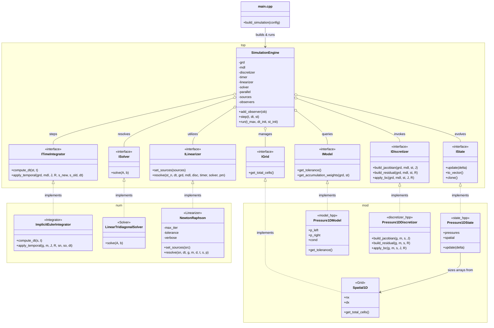

# AXSCNT 
**Architecture of eXperimental Software for Computational Numerical Techniques** (*Pronounced: /ax-SENT/*) is a **coding framework** built to **enable implementation** across **mathematics**, physics, and software engineering. It uses an **Isomorphic Domain Architecture**, guiding the workflow from the first symbolic derivation to the final production kernels. By focusing on **Coding-Level Transparency**, AXSCNT makes sure the math remains easy to read and understand directly in the source code, while still using powerful optimizations to ensure high performance.

| Stage | Focus | Implementation | Role in Ecosystem |
| :--- | :--- | :--- | :--- |
| <small>**1. Formulation**</small> | <small>Theoretical Derivations</small> | <small>**Symbolic Mathematics**</small> | <small>Exact PDE definitions and analytical solutions.</small> |
| <small>**2. Prototyping**</small> | <small>Numerical Stability</small> | <small>**Interactive Python**</small> | <small>Rapid experimental verification and stability analysis.</small> |
| <small>**3. Production**</small> | <small>High Performance</small> | <small>**Compiled C++**</small> | <small>Optimized, parallelized, and memory-safe numerical engine.</small> |
| <small>**4. Python Binding**</small> | <small>Interoperability</small> | <small>**C++ Extensions**</small> | <small>High-speed connectivity for hybrid research-production workflows.</small> |
| <small>**5. Insight**</small> | <small>Visualization</small> | <small>**Post-Processing**</small> | <small>Multi-dimensional field monitoring and interactive analytics.</small> |

---

### Project Structure

```bash
axscnt/
├── src/
│   ├── lib/            # Foundational Framework & Numerical Utilities (C++)
│   └── modules/        # Domain-Specific Physics Engines (C++)
│       ├── oscillator/     
│       ├── fluids/         
│       ├── thermodynamics/ 
│       └── ...             
├── bindings/           # High-performance C++ connectivity (axcnt_cpp)
├── notebook/           # The Analytical Bridge (Math ➔ Python ➔ C++)
│   ├── oscillator/     
│   ├── fluids/         
│   ├── thermodynamics/ 
│   └── ...             
├── benchmark/          # Performance & Scalability Benchmarking
├── dist/               # Production-ready C++ Executables
└── exports/            # Standardized Simulation Outputs (VTK, JSON, CSV)
```

---

### Internal Architecture
#### The Numerical Engine
- **Architectural Contracts (namespaces `top`)**: Defines the abstract interfaces (`IState`, `IModel`, `ISolver`) that enforce the AXSCNT "Simulation Contract".
- **Numerical Core (namespaces `num`)**: Contains vectorized linear solvers (BiCGSTAB, Tridiagonal), non-linear Newton-Raphson schemes, and sparse matrix implementations.
- **Infrastructure (namespaces `utl`)**: Handles cross-cutting concerns like hierarchical configuration, standardized logging, and filesystem orchestration.

#### Physics Module Anatomy (namespaces `mod`)
1.  **`mdl.hpp`**: Defines the physical constants and the **Governing Equation** discretization.
2.  **`st.hpp`**: A structured snapshot of the field data at any point in time.
3.  **`main.cpp`**: The central orchestrator that handles both the **Factory/Builder** setup (assembling the object graph) and the **Execution** phase.



#### Software Engineering Design Patterns
*   **Strategy Pattern (`ITimeIntegrator`, `ISolver`)**: Enables dynamic swapping of numerical methods (e.g., changing from `ImplicitEuler` to `RungeKutta4` or swapping linear solvers) without altering the governing physical models.
*   **Builder / Factory Pattern (`main.cpp`)**: Encapsulates the complex instantiation and wiring of the numerical object graph (Grid ➔ Discretizer ➔ Linearizer ➔ Solver) to ensure a clean, reproducible setup phase for any physics module.
*   **Facade Pattern (`axcnt_cpp` bindings)**: Provides a streamlined, high-level Python interface that masks the complexity of the underlying C++ simulation engine, effectively forming the "Analytical Bridge" for researchers.
*   **Template Method & Interface-Driven Design (`top` namespace)**: Core contracts like `IModel`, `IState`, and `ISolver` define the strict skeleton of a simulation lifecycle, ensuring all distinct physics modules behave polymorphically and predictably.

---

### Quick Start

#### 1. Setup the Analytical Environment
```bash
python -m venv .venv
source .venv/bin/activate
pip install -r requirements.txt
```

**Note on Interactive Python Files (`.py`)**:
The analytical notebooks in this project are stored as plain-text `.py` files using the standard `# %%` cell marker format. This keeps version control clean.
*   **VS Code / Cursor**: You can run these files natively in the "Interactive Window" by clicking `Run Cell` above any `# %%` block.
*   **Standard Jupyter**: If you prefer the classic Jupyter interface, install `jupytext` to seamlessly open and edit these `.py` files as notebooks.

#### 2. Compile the Production Engine
```bash
make all
```

#### 3. Run 'Hello World' (Harmonic Oscillator)
AXSCNT uses the **Simple Harmonic Oscillator** as its primary "Hello World" sample. It represents the simplest implementation of the **Simulation Contract**, allowing for immediate verification against analytical solutions.

```bash
# Run the Production C++ Engine
./dist/oscillator

# The output is exported for validation
cat exports/oscillator_output.csv
```

#### 4. Visualize the Analytical Bridge
Compare the C++ production results with the symbolic analytical ground truth using the provided notebook.

```bash
# Open the Bridge Notebook
# (Requires VS Code Interactive Window or Jupytext)
notebook/oscillator/Harmonic_Oscillator_Bridge.py
```


---

### Contributing

AXSCNT is built from & for the community. We welcome contributions that bridge the gap between theoretical physics and high-performance software.

#### 1. The Analytical Bridge Workflow
Every contribution should ideally follow our three-stage verification process:
1.  **Formulation**: Derive the symbolic math in a Jupyter notebook (`notebook/`) using **Symbolic Mathematics**.
2.  **Prototyping**: Implement a numerical prototype in **Python** to verify stability.
3.  **Production**: Port the kernel to **C++** using the standardized `top` and `num` interfaces.

#### 2. Implementing Physics Modules
New modules must adhere to the **Simulation Contract** defined in the `top` namespace:
*   Implement `IModel` for physical parameters and governing equations.
*   Implement `IState` for time-dependent field data.
*   Use the existing `num` solvers where possible, or contribute new ones to the core math library.

#### 3. Standards & Verification
*   **Namespaces**: Maintain strict segregation (`top`, `num`, `mod`, `utl`).
*   **Testing**: Ensure all tests pass before submitting a Pull Request:
    ```bash
    make test
    ```
*   **Performance**: Prioritize vectorized operations and OpenMP-friendly kernels.

#### 4. Pull Requests
1.  Fork the repository and create your feature branch.
2.  Follow consistent commit messages.
3.  Ensure your code is documented with Doxygen-style comments.
4.  Open a PR targeting the `main` branch.

